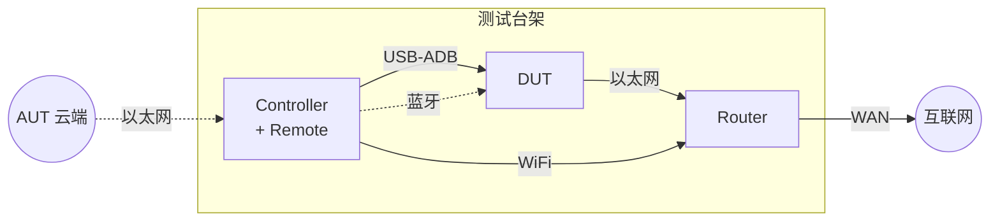

# 测试环境定义规范

每个测试拓扑对应一组文件，放在 `environments/` 下。

## 文件组成

```
environments/
├── <env_id>.yaml     # 设备参数定义（机器可读，workflow 引用）
├── <env_id>.mmd      # 拓扑图（Mermaid 格式，可直接预览）
├── topology.md       # 所有拓扑一览（可选）
├── hardware.md       # 物理硬件清单
└── params.json       # 当前环境的具体参数值（device_id, IP, SSH 等）
```

## YAML 结构

env YAML **仅定义设备需要哪些参数及其类型**，不填写具体值。
实际值（device_id、IP、密码等）在 `params.json` 中统一管理。

```yaml
id: <env_id>                          # 唯一标识，spec 中 testbed 引用此值
description: <文本>                    # 拓扑用途说明
topology_diagram: <env_id>.mmd        # 指向同目录下的 Mermaid 拓扑图

devices:                              # 设备清单
  <device_key>:                       # 设备标识（dut, controller, router, peer_pc 等）
    type: <设备类型>                   # android_ott / android_device / linux_pc / wifi_router / ...
    role: <角色描述>                   # 一句话说明在测试中的职责
    description: <详细说明>            # 可选，补充角色说明
    params:                           # 参数 schema（仅定义，不填值）
      <param_name>: {type, description, default?}
    # 仅 Controller：调试期用 Linux PC 替代
    profile_debug:
      type_override: linux_pc
      params: {...}                   # 调试期额外参数 schema
    # 仅非必需设备：标记参与的用例
    present_when: [<case_id>, ...]
    # 设备由另一个设备虚拟
    provided_by: <device_key>

aut_cloud:                            # AUT 云端（固定存在）
  type: web_service
  role: 用例调度

capabilities:                         # 环境能力声明（可选）
  ipv4_dhcp: true
  router_ssh: true
  ...
```

### 参数值与 schema 分离

| 文件 | 职责 |
|------|------|
| `<env>.yaml` | 定义参数 schema（名称、类型、说明） |
| `params.json` | 填写当前环境的实际参数值 |

示例：
```yaml
# ethernet_router_lan.yaml（schema）
router:
  params:
    ip:  {type: str, description: LAN IP 地址}
    ssh: {type: object, description: SSH 登录凭据}
```
```json
// params.json（实际值）
{
  "router": {
    "ip": "192.168.50.1",
    "ssh": {"username": "AX86U", "password": "New!123456"}
  }
}
```

## 设备类型

| type | 说明 |
|------|------|
| `android_ott` | Android TV/OTT 盒子（DUT） |
| `android_device` | Android 设备（Controller） |
| `linux_pc` | Linux PC（Peer PC / 调试期 Controller） |
| `wifi_router` | 无线路由器 |
| `dhcp_router` | 有线路由器 |
| `bluetooth_rcu` | 蓝牙遥控器 |
| `power_relay` | 继电器 |
| `web_service` | 云端 Web 服务 |

## 连接类型

| link | 说明 |
|------|------|
| `ethernet_cable` | 网线直连 |
| `usb_adb` | USB-ADB 调试连接 |
| `wifi` | WiFi 无线连接 |
| `wan` | 广域网出口 |
| `company_lan` | 公司内网（云端 ↔ Controller） |
| `bluetooth` | 蓝牙无线 |

## 角色多标签

如果一个设备承担多个角色（如 Controller 同时充当遥控器），在 `role` 中写 `+` 分隔：
```yaml
controller:
  role: 测试执行器 + 遥控器
```

## MMD 拓扑图规范

- **只写角色名**，不写具体型号、IP、网段
- 示例：`ctrl["Controller<br/>+ Remote"]` 表示 Controller 兼遥控器
- 连线标注连接类型和方向
- 详情（型号、IP、SSH）记录在 YAML 的 `devices.<key>.params` 中



## 调试期 vs 目标环境

Controller 在目标环境中是 Android 设备，当前调试期用 Linux PC 替代。通过 `profile_debug` 标记：

```yaml
controller:
  type: android_device              # ← 目标
  params:
    device_id: AMLS905X4AH212BT164
  profile_debug:                    # ← 当前调试
    type_override: linux_pc
    params_override:
      ssh: {username: ..., password: ...}
      ...
```

## 非必需设备

仅在特定用例出现的设备，用 `present_when` 标记：
```yaml
peer_pc:
  type: linux_pc
  role: 直连对端
  present_when: [Ethernet_new_function_002]
  ...
```
