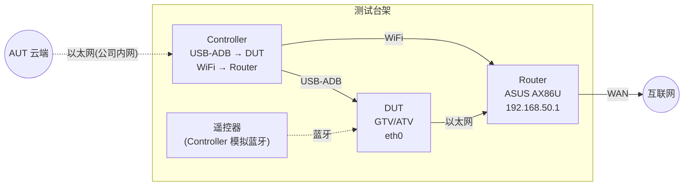
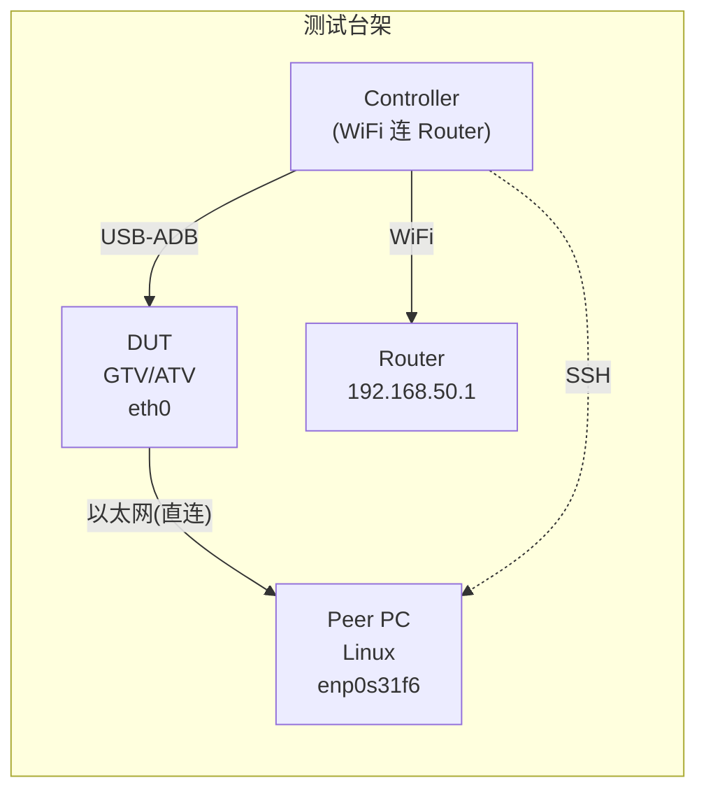

# 网络拓扑

> Mermaid 图预览: VS Code 装 `Markdown Preview Mermaid Support` 插件，
> 或复制代码到 https://mermaid.live

## ethernet_router_lan（标准以太网测试拓扑）



### 设备角色表

| 设备 | 类型 | 角色 | 环境参数来源 |
|------|------|------|-------------|
| DUT | android_ott | 被测设备 | `ethernet_router_lan.yaml` devices.dut.params |
| Controller | android_device (debug: linux_pc) | 测试执行器 | devices.controller.params / profile_debug |
| Router | wifi_router | 网络服务 + 测试辅助 | devices.router.params |
| Remote | bluetooth_rcu | 遥控输入 | Controller 模拟 (provided_by) |
| AUT Cloud | web_service | 用例调度 | aut_cloud |

## ethernet_direct_pc（直连互 Ping 拓扑，002 专用）



## 角色定义

```
┌──────────────────────────────────────────────────────────────┐
│  自动化测试系统（云端/工作 PC）                               │
│  通过以太网连接 Controller，下发测试指令                      │
└──────────────────────┬───────────────────────────────────────┘
                       │ 以太网
                       │
┌──────────────────────▼───────────────────────────────────────┐
│  Controller（当前: Linux PC, 未来: Android 设备）            │
│  - USB-ADB 直连 DUT，执行 adb 指令                           │
│  - WiFi 连接 Router，与 DUT 在同一链路                       │
│  - (Android Controller) 蓝牙遥控器配对 DUT                  │
└──┬──────────────────────┬────────────────────────────────────┘
   │ USB-ADB              │ WiFi
   │                      │
┌──▼────┐          ┌──────▼──────┐
│  DUT  │  有线    │   Router    │
│ GTV/  │─────────│  AX86U      │
│ ATV   │  eth0   │ 192.168.50.1│
└───────┘         └─────────────┘
```

## 当前调试环境物理拓扑

```text
                     ┌─────────────┐
                     │   Router     │
                     │  AX86U       │
                     │ 192.168.50.1 │
                     └──┬───┬───┬──┘
          LAN eth2      │   │   │   WiFi 5GHz (AX86U)
                        │   │   │
        ┌───────────────┘   │   └──────────────────┐
        │                   │                       │
   ┌────▼────┐        ┌─────▼─────┐          ┌──────▼──────┐
   │   DUT   │        │  unused   │          │ Controller  │
   │  GTV/ATV│        │  LAN port │          │  Ubuntu     │
   │ eth0    │        │           │          │ 24.04       │
   └────┬────┘        └───────────┘          │             │
        │                                     │ enp0s31f6:  │
   USB-ADB                                    │ 10.138.8.178│
        │                                     │ (公司内网)  │
        │                                     │             │
        │                                     │ wlp5s0:     │
        └─────────────────────────────────────│ 192.168.    │
                 USB 直连到 Controller         │ 50.136      │
                                              └─────┬────────┘
                                                    │ 以太网
                                                    │
                                          ┌─────────▼────────┐
                                          │ 工作 PC (Windows) │
                                          │ 运行 Claude Code  │
                                          │ 通过 Samba 编辑   │
                                          │ 代码              │
                                          └──────────────────┘
```

## 角色说明

| 角色 | 当前实现 | 后续可能 | 职责 |
|------|---------|---------|------|
| **Controller** | Linux PC (Ubuntu 24.04) | Android 设备 | USB-ADB 连接 DUT，执行测试指令；WiFi 连路由器与 DUT 同链路 |
| **自动化系统** | 工作 PC (Windows) | 云端服务 | 通过以太网控制 Controller，下发 workflow 测试命令 |
| **DUT** | GTV/ATV | — | 被测设备，eth0 有线连路由器 |

## IP 分配

| 设备 | 接口 | IP | 用途 |
|------|------|----|------|
| Router AX86U | br0 (LAN+WiFi) | 192.168.50.1 | 网关、DHCP |
| Router AX86U | br0 (IPv6) | fd00::1/64 | IPv6 ULA 网关（测试用） |
| DUT | eth0 | DHCP (192.168.50.x) | 被测设备 |
| DUT | eth0 (IPv6) | SLAAC (fd00::/64) | IPv6 自动配置 |
| Controller | wlp5s0 | 192.168.50.136 | WiFi 管理网络 |
| Controller | enp0s31f6 | 10.138.8.178 | 连接自动化系统 |

## 链路

| 连接 | 类型 | 说明 |
|------|------|------|
| DUT ↔ Router eth2 | 有线 Ethernet | 测试主链路 |
| Controller ↔ Router | WiFi 5GHz | 管理和 RA 发送 |
| DUT ↔ Controller | USB-ADB | 测试控制通道 |
| 自动化系统 ↔ Controller | 以太网 | 测试指令下发 |

## IPv6 RA 方案（当前临时）

Controller (Linux PC) 通过 `send_ra_v2` 工具发送 ICMPv6 RA 包到 WiFi 链路 `wlp5s0`，广播 `fd00::/64` 前缀。

**局限性**：依赖 Linux 平台的 raw socket 和 `sudo`，无法在 Android Controller 上运行。后续需要更通用的方案。

详见 [decisions/2026-05-25-ra-via-controller.md](../decisions/2026-05-25-ra-via-controller.md)
